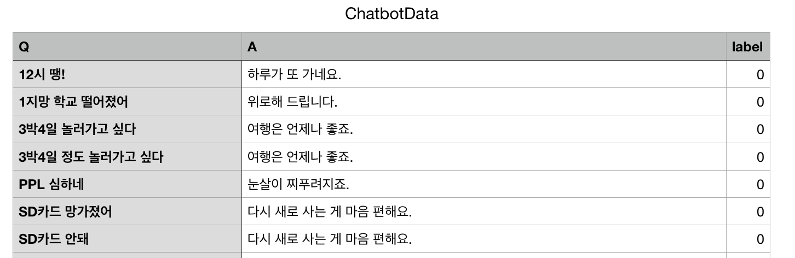
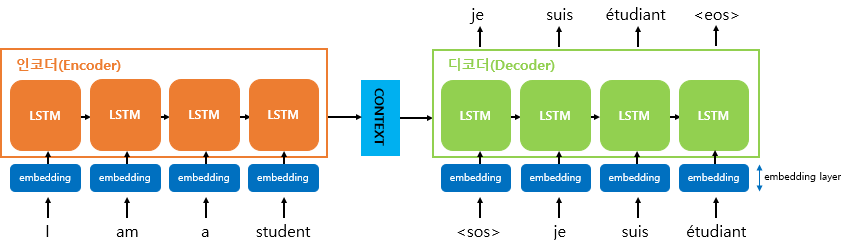

# Chatbot_data.          
Chatbot_data_for_Korean v1.0             

## Data description.    

인공데이터입니다. 일부 이별과 관련된 질문에서 다음카페 "사랑보다 아름다운 실연( http://cafe116.daum.net/_c21_/home?grpid=1bld )"에서 자주 나오는 이야기들을 참고하여 제작하였습니다. 
가령 "이별한 지 열흘(또는 100일) 되었어요"라는 질문에 챗봇이 위로한다는 취지로 답변을 작성하였습니다. 

1. 챗봇 트레이닝용 문답 페어 11,876개           
2. 일상다반사 0, 이별(부정) 1, 사랑(긍정) 2로 레이블링                
                      
                     
## Quick peek.                
                                     

## 관련 코드 : [Korean Language Model for Wellness Conversation](https://github.com/nawnoes/WellnessConversationAI?fbclid=IwAR3ZhXYW_DwI2RXP1mbHzvafGXF80QWERa4t6TTz_m2NQug5QwjOwQt6Hvw)
- 이 곳에 저장된 데이터를 만들면서 누군가에게 위로가 되는 모델이 나오면 좋겠다고 생각했었는데 제 생각보다 더 잘 만든 모델이 있어서 링크 걸어 둡니다. 부족한 데이터지만 이곳에 저장된 데이터와 [AI 허브 정신건강 상담 데이터](http://www.aihub.or.kr/keti_data_board/language_intelligence)  를 토대로 만들었다고 합니다. 
- 전창욱 외(2020), 텐서플로2와 머신러닝으로 시작하는 자연어처리, 위키북스( http://cafe116.daum.net/_c21_/home?grpid=1bld )의 챗봇 부분에도 이 데이터가 사용된 것으로 알고 있습니다. 빠르게 챗봇 만들고 싶으신 분들은 참고하셔도 좋을 것 같습니다.
- 데이터 로더를 통한 다운로드는 다음 링크 [Korpora: Korean Corpora Archives](https://github.com/ko-nlp/Korpora)를 참고하시면 편하게 사용하실 수 있을 듯합니다.

#인용

Youngsook Song.(2018). Chatbot_data_for_Korean v1.0)[Online]. Available : https://github.com/songys/Chatbot_data (downloaded 2022. June. 29.)
---
## 1. Sequence-to-sequence Model(seq2seq)
- 입력된 시퀀스로부터 다른 도메인의 시퀀스를 출력하는 다양한 분야에서 사용
- 챗봇과 기계번역, 내용 요약, STT(Speach to Text) 등에서 활용
- 내부가 보이지 않는 블랙 박스에서 RNN의 조립을 통해 구조를 생성
- **인코더**와 **디코더**라는 두 개의 모듈로 구성되며 각각의 RNN 아키텍쳐를 보유
- 각각의 모듈은 RNN셀로 구성된 아키텍쳐로 성능을 위해 바닐라 RNN이 아니라 LSTM 셀 혹은 GRU 셀들로 구성

### Encoder
- 입력 문장의 모든 단어들을 순차적으로 입력받은 뒤에 마지막에 이 모든 단어 정보들을 압축해서 **하나의 Context vector**를 생성
- 인코더 RNN 셀의 마지막 시점의 은닉상태를 context vector라 함

### Decoder
- 인코더로부터 전송받은 Context vector를 변환된 단어로 하나씩 순차적으로 출력
- 디코더는 기본적으로 RNNLM(RNN Language Model)
- 테스트 과정과 훈련 과정의 작동방식에서 차이가 있음

1. `테스트 과정`
- Context vector와 초기 입력으로 문장의 시작을 의미하는 심볼 `<sos>`을 입력으로 받음
- 다음에 등장 확률이 높은 단어 예측하고 예측된 단어를 다음 입력으로 활용
- 문장의 끝을 의미하는 `<eos>`가 예측될 때까지 위의 과정을 반복

2. `훈련 과정`
- 디코어에게 인코더가 보낸 Context vector와 실제 정답을 입력받고, 나와야 하는 정답을 알려주면서 훈련(실제 정답은 `<sos>`로 시작하는 문장, 나와야 하는 정답은 `<eos>`로 끝나는 문장)
- 해당 과정을 교사 강요(teaching forcing)이라고 함

Ref.[Blog wikidocs.net - seq2seq](https://wikidocs.net/24996)